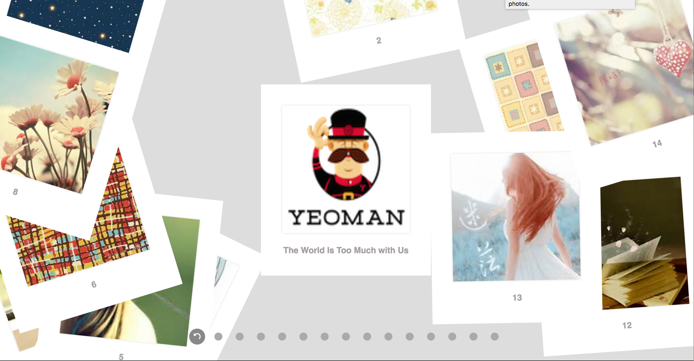
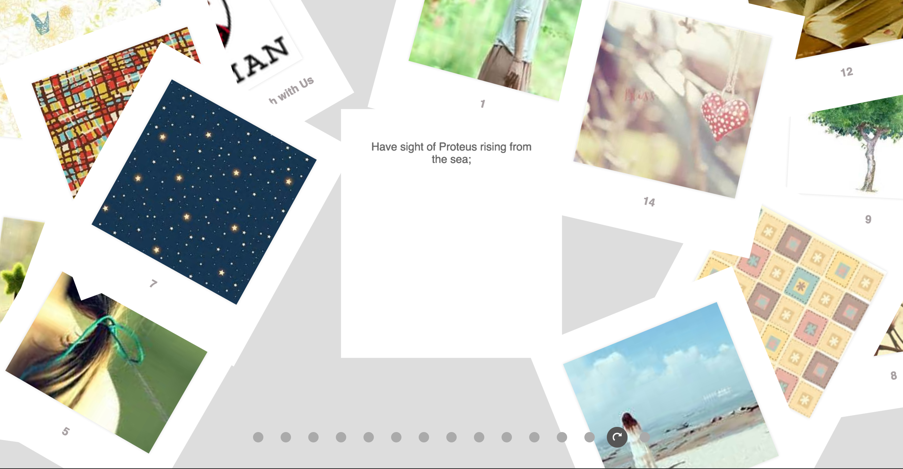

# The Gallery SPA by ReactJS
This is a single page application built by reactjs. It implements suffle a set of cards dynamically when first load. And enable you to select a card and center it by click the card itself or click the corresponding dot in the controller bar below. When click the centered card, it flipped to its back with a reverse animation, and the controller bar also shows reverse effect accordingly.
Below are the screenshots of overall effect for both front and back side.

Init page

When select a card and turns its back

There is also a github pages for play around:[Click me](https://manyang.github.io/react-spa-gallery/)